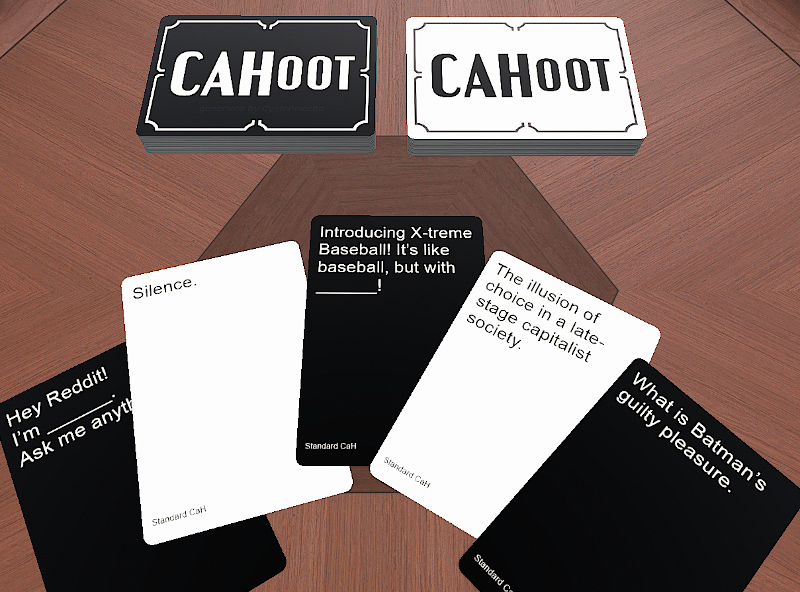

# cah_card_generator
Think you're funny enough to make your own Cards Against Humanity cards?  
Use my "CAHoot" app to generate images for your own Black and White CaH cards.  
It includes the Standard CaH decks, under their Creative Commons BY-NC-SA 2.0 License.  You can just generate these, or you can use them as an example for how to make your own.  
  
CAHoot creates individual card images (409px by 585px PNGs)  
It also creates 10x7 deck sheet images (4090px by 4095px PNGs)  
This is for easy import into Tabletop Simulator (its default custom card/deck sizes)  

Setup:  
I created this in Visual Studio 2019  
All Input/Output is under the root Project folder.  
The app's entry point is CahGen.Program.Main()  
You should be able to clone/modify/run this project.  

Easy Setup:  
1) Clone the repo  
2) To make a custom deck, Create additional \*.txt files in ./CardTextBlack and ./CardTextWhite  
3) run ./bin/Debug/CahGen.exe
4) Get generated Cards/Decks from ./GeneratedCards/\*.png and ./GeneratedDecks/\*.png
5) Get the Images for the Back Face of the cards in ./CardBacks/\*.png

Import Into Tabletop Simulator:  
1) Create a room in Tabletop Sim  
2) Create Object > Component > Decks > Custom Deck  
3) It will prompt you to import a deck sheet  
4) Select one a deck sheet from ./GeneratedDecks/*.png  
5) Choose 10x7 for the deck sheet size  
6) Choose the number of cards in the deck  
 - NOTE: The image name ends in "total_70.png" if it is a full sheet with 70 cards  
 - If the sheet isn't full, choose the number of cars the image name says (e.g. "total_10.png" would be 10 cards)  
 - If the deck has more than 70 cards, you will have to create multiple custom decks in Tabletop Sim, and stack them after you've spawned them.  
7) Choose the image for the back of the card in ./CardBacks  
8) You will need to import the Black Deck and the White Deck separately  

References:  
[Cards Against Humanity](https://www.cardsagainsthumanity.com/)  
[Tabletop Simulator](https://steamcommunity.com/app/286160/)  

License:  
Creative Commons BY-NC-SA 2.0 (as required by CaH)

